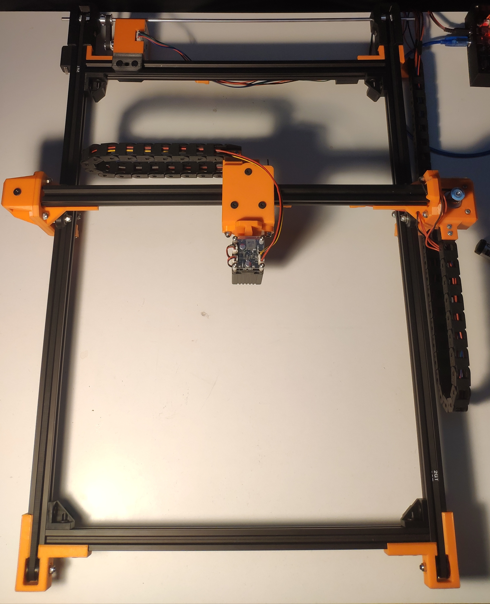
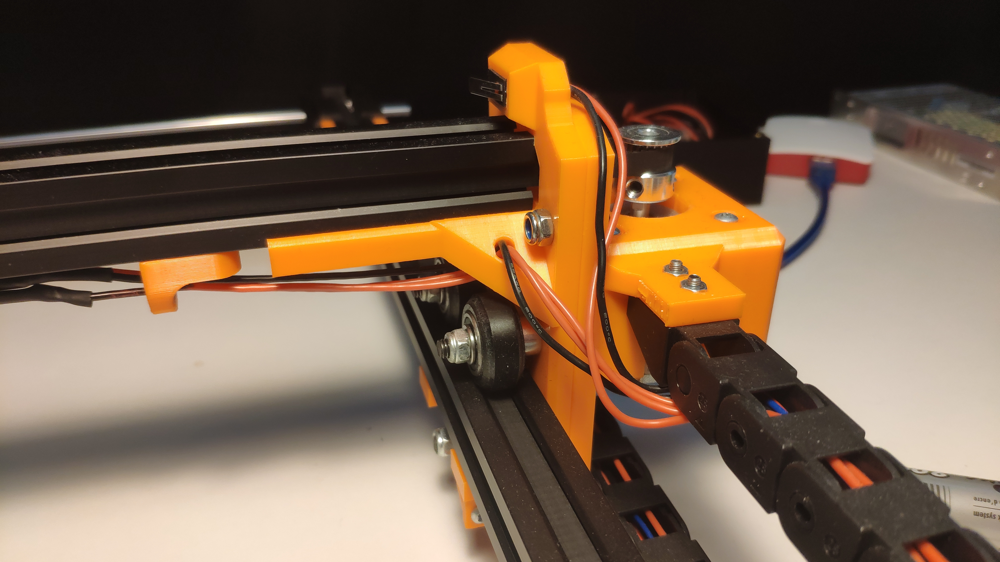

# laser engraver

## OnShape assembly view
https://cad.onshape.com/documents/3f9110356f41e6776f25925a/w/263c22464186373e995c15c4/e/6fd8785cf47d64ac06c295a4

CNC machine, laser plotter. 

## Electronics, software:
    makerbase mks dlc 2.1 --> grbl
    raspberryPI 3A+ --> raspbianLite, CNCjs
    4W laser module

## Video

## Pictures

